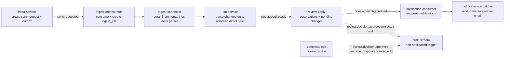

# Input-to-Notification Dataflow (High-Level)

## 1) Scope

This document provides a high-level dataflow view from `input-service` to `notification-service` in the current microservice runtime:

`input-service -> ingest-service -> llm-service -> review-service -> notification-service`

Scope includes the main event-driven path and state transitions needed to build a dataflow table quickly.

Out of scope:

- payload field-level schema details (see `docs/event_contracts.md`)
- SQL-level implementation details

Important bypass rule:

- canonical edit mode (`/review/edits`, `mode=canonical`) is an approved-entity audit bypass path and does **not** trigger `review.pending.created`

## 2) High-Level Flow (Mermaid)

## 3) Node Notes

- `input-service`: receives sync trigger (manual/scheduler/webhook), writes `sync_requests`, emits `sync.requested`.
- `ingest-orchestrator`: consumes `sync.requested`, creates `ingest_jobs`, advances request status to queued.
- `ingest-connector`: claims jobs with source-level FIFO, fetches source data (Gmail incremental or ICS delta), prepares parse payload.
- `llm-service`: parses only changed items; removal records can pass without LLM call in delta flow.
- `review-apply`: writes/updates `source_event_observations`, computes pending `changes`, emits notification trigger event.
  - runtime observation payload is fixed to `source_facts + semantic_event + link_signals + kind_resolution`
  - parser-stage `semantic_event_draft` is normalized immediately and is not a runtime observation field
  - unresolved ingest records (missing course identity) are isolated to backend unresolved bucket and do not enter review pending flow
- `notification-consumer`: consumes pending-created events and enqueues `notifications`.
- `notification-dispatcher`: groups newly due pending review items per user and sends an immediate review email.

## 4) Event Contract Strip

| Event | Producer -> Consumer | Purpose |
| --- | --- | --- |
| `sync.requested` | input -> ingest | request ingestion for a source |
| `ingest.result.ready` | ingest/llm -> review | provide normalized extraction result for apply/merge |
| `review.pending.created` | review -> notification | trigger notification enqueue for new pending changes |
| `review.decision.approved` / `review.decision.rejected` | review -> audit consumers | decision audit path, not a notification trigger by itself |

## 5) State Transition Strip

| Entity | Transition |
| --- | --- |
| `sync_requests` | `PENDING -> QUEUED -> RUNNING -> SUCCEEDED/FAILED` |
| `ingest_jobs` | `PENDING -> CLAIMED -> SUCCEEDED/DEAD_LETTER` |
| `integration_outbox` | `PENDING -> PROCESSED/FAILED` |
| `notifications` | `PENDING -> SENT/FAILED` |

## 6) Per-Step Dataflow (8 Steps)

| Step | Producer | Trigger | Reads | Writes | Emits | Next |
| --- | --- | --- | --- | --- | --- | --- |
| 1 | input-service | user/scheduler/webhook sync trigger | `input_sources`, `input_source_configs`, `input_source_cursors` | `sync_requests`, `integration_outbox(sync.requested)` | `sync.requested` | ingest-orchestrator |
| 2 | ingest-orchestrator | outbox `sync.requested` available | `integration_outbox`, `sync_requests` | `ingest_jobs`, `integration_inbox`, `sync_requests(status=QUEUED)` | none | ingest-connector |
| 3 | ingest-connector | claimed pending ingest job | `ingest_jobs`, `sync_requests`, source config/secret/cursor | `ingest_jobs(status=CLAIMED/RUNNING payload)`, `input_source_cursors` | none | connector fetch |
| 4 | ingest-connector | fetch result available | Gmail: provider incrementals + buffered term-window bootstrap/filter (`term_from-30` to `term_to+30`); ICS: delta parser snapshot + VEVENT buffered term filter | `ingest_jobs(payload parse task)`, retry metadata | none | llm-service |
| 5 | llm-service | Redis parse task consumed | parse payload (`gmail` / `calendar_delta`) | `ingest_results`, `ingest_jobs`, `sync_requests`, `integration_outbox` | `ingest.result.ready` | review-apply worker |
| 6 | review-apply worker/service | outbox `ingest.result.ready` available | `ingest_results`, `source_event_observations`, `event_entities`, `changes`, `ingest_unresolved_records` | resolvable records: `source_event_observations`, `changes(pending)`, `integration_outbox`; unresolved records: `ingest_unresolved_records` only | `review.pending.created` (resolvable path only) | notification-consumer |
| 7 | review decision APIs | user approve/reject/batch decision/unified edit | `changes`, `event_entities` | approved entity state updates on approve or canonical edit, proposal updates on proposal edit | `review.decision.approved/rejected` | audit consumers |
| 8 | notification-consumer + notification-dispatcher | outbox `review.pending.created` and newly due pending notifications | `integration_outbox`, `notifications` | `notifications(PENDING->SENT/FAILED)` | immediate review email side effects | completed |

## 7) Failure Paths (High-Level)

- connector/llm execution failure: retry with backoff, then dead-letter when retry policy is exhausted
- review-apply failure: consumer marks event processing failed and sync request may end as failed
- notification enqueue/send failure: notification status becomes failed and the row keeps the send error

## 8) Source-of-Truth Code Pointers

Use these files as implementation anchors when building detailed dataflow tables:

- `app/modules/input_control_plane/sources_service.py`
- `app/modules/input_control_plane/sync_requests_service.py`
- `app/modules/input_control_plane/oauth_service.py`
- `app/modules/ingestion/orchestrator.py`
- `app/modules/ingestion/connector_runtime.py`
- `app/modules/llm_runtime/tick_runner.py`
- `app/modules/core_ingest/worker.py`
- `app/modules/core_ingest/apply.py`
- `app/modules/notify/consumer.py`
- `app/modules/notify/digest_service.py`

## 9) Notes for Dataflow Table Authors

- Keep main chain order as: `sync.requested -> ingest.result.ready -> review.pending.created`.
- Treat `review.decision.*` as an audit stream, not a notification trigger chain.
- Keep canonical edit explicitly marked as bypass behavior relative to pending-created notifications.
- Keep user-facing family label display aligned to latest label by `family_id`; do not treat frozen snapshot names as display authority.
- Treat missing `family_id`/family-row label authority as an integrity bug (fail loudly), not a normal display fallback path.
- Treat missing course identity as unresolved ingest isolation (`ingest_unresolved_records`), not as normal reviewable pending change input.
- Treat source term window (`term_key` / `term_from` / `term_to`) as an ingest hard boundary with fixed runtime derivation: `bootstrap_from = term_from-30d`, `monitor_until = term_to+30d`; out-of-window content must not enter normal review flow.
- Treat term-window edits as a backend rescope workflow: no in-flight sync -> apply immediately; in-flight sync -> store single coalesced `pending_term_rebind`, block manual sync (`source_term_rebind_pending`), then apply on first terminal sync (`SUCCEEDED`/`FAILED`).
- Family lifecycle policy: no normal hard-delete path for family rows; manage via rename/relink workflows.
- `course_work_item_family_rebuild` is observation-native: it updates active runtime observations and recomputes pending proposals without parser-payload replay.
